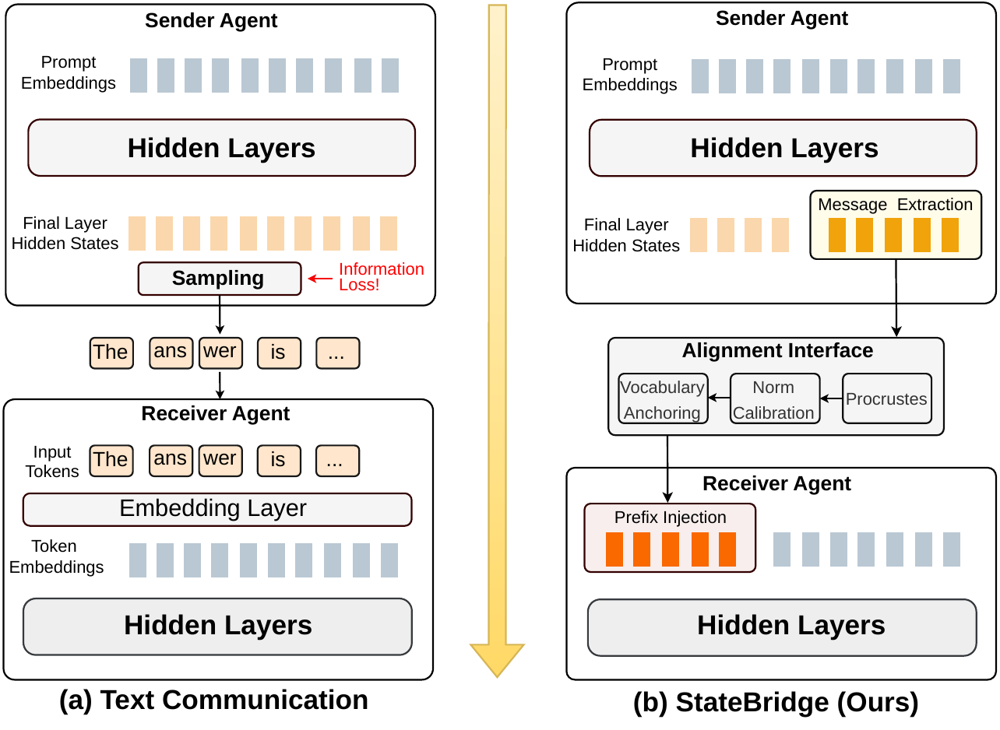
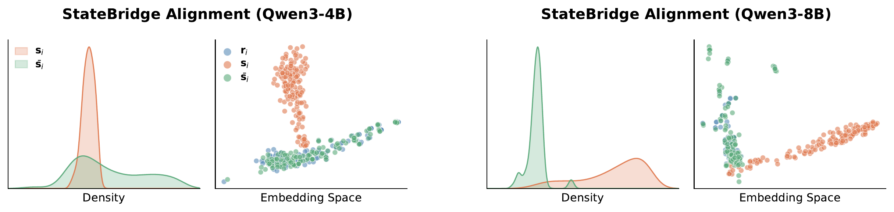
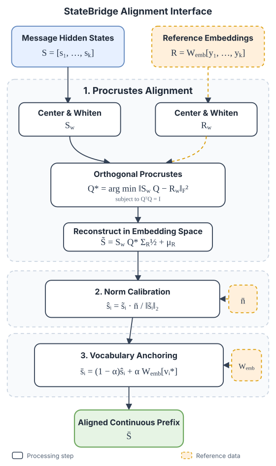

<div align="center">

# StateBridge

### Training-free Hidden-state Alignment for Latent Communication in LLM Multi-Agent Systems

**[Yanwen Peng](mailto:ypeng86@sheffield.ac.uk) &nbsp;·&nbsp; [Delvin Ce Zhang](mailto:delvin.ce.zhang@sheffield.ac.uk) &nbsp;·&nbsp; [Xi Wang](mailto:xi.wang@sheffield.ac.uk) &nbsp;·&nbsp; [Nikolaos Aletras](mailto:n.aletras@sheffield.ac.uk)**

School of Computer Science, University of Sheffield

[](https://colmweb.org/)
[](LICENSE)
[](https://www.python.org/)
[](https://pytorch.org/)

<!-- Uncomment once the arXiv preprint is live:
[](https://arxiv.org/abs/XXXX.XXXXX)
-->

**Agents talk in tokens. StateBridge lets them talk in hidden states, with no training at all.**

[Quick Start](#quick-start) &nbsp;·&nbsp; [Results](#results) &nbsp;·&nbsp; [How It Works](#how-it-works) &nbsp;·&nbsp; [Reproducing the Paper](#reproducing-the-paper) &nbsp;·&nbsp; [FAQ](#faq) &nbsp;·&nbsp; [Citation](#citation)

</div>

---

## News

- **2026-08** &nbsp; StateBridge is accepted to **COLM 2026**.
- **2026-07** &nbsp; Core research release [`v0.1.0`](RELEASE_NOTES.md) is public.

## TL;DR

Multi-agent LLM systems communicate in text. Turning a sender's continuous hidden state into discrete tokens throws away everything that token identities cannot express.

StateBridge keeps the message continuous. It takes the sender's final-layer hidden states, aligns them to the receiver's **input embedding space** with a closed-form orthogonal transformation, and prepends the result as a continuous prefix through `inputs_embeds`.

**No training. No learned projector. No gradient updates. No changes to the transformer.** Just linear algebra between two agents that already share the same weights.



<div align="center"><i>Text communication samples discrete tokens. StateBridge transfers an aligned continuous prefix.</i></div>

## Why StateBridge

Passing hidden states directly does not work: they have the right dimensionality but sit in a different region of representation space than the input embeddings the receiver was pretrained to read. Prior work resolves this mismatch either by injecting states across every transformer layer, or by training a projector. StateBridge resolves it with alignment alone.

| | Training | Learned params | Model changes | Injection point | Message memory | Across model families |
|---|:---:|:---:|:---:|:---:|:---:|:---:|
| **TextMAS** | None | None | None | Discrete tokens | — | Portable |
| **KV-cache transfer** (LatentMAS) | None | None | Injection at every layer | All $L$ layers | $O(TLd)$ | Layer-structure dependent |
| **Learned projector** (InterLat, Thought-Comm) | Required | Projector | None | Input embedding | $O(Kd)$ | Retraining required |
| **StateBridge** | **None** | **None** | **None** | Input embedding | $O(Kd)$ | **Portable** |

$T$ = generated tokens, $L$ = transformer layers, $d$ = hidden size, $K$ = prefix length (64 by default).

Two consequences follow from operating only at the input embedding layer:

**Portability.** On OLMo3-7B-Think, KV-cache transfer averages 55.1% while plain text averages 73.9%. The pipeline, prompts, and decoding settings are identical across methods, so the gap comes from the communication channel: injecting states across every layer breaks when layer structure differs between model families. StateBridge reaches 76.7% on the same setting.

**Memory.** A forward hook on the final transformer layer records only that layer's output, so extraction costs $O(Td)$ instead of $O(TLd)$, and only the last $K$ states are kept. KV-cache transfer stores $O(TLd)$ per agent.

## Results

Across 26 model-task evaluations from eight benchmarks, StateBridge is **best or tied-best on 22 of 26 pairs** and achieves the highest average in every model setting.

| Model setting | StateBridge | Best baseline | Δ | Best / tied |
|---|---:|---:|---:|---:|
| Qwen3-4B | **82.4** | 80.0 (LatentMAS) | **+2.4** | **5 / 5** |
| OLMo3-7B-Think | **76.7** | 73.9 (TextMAS) | **+2.8** | **4 / 5** |
| Qwen3-8B | **74.3** | 71.8 (LatentMAS) | **+2.5** | **7 / 8** |
| Qwen3-32B | **81.0** | 78.1 (TextMAS) | **+2.9** | **6 / 8** |

Accuracy for QA and mathematical reasoning, pass@1 for code generation. Averages are unweighted across the tasks evaluated for each model setting.

<details>
<summary><strong>Full results: all 26 model-task pairs</strong></summary>

<br>

**Single** = single-agent generation &nbsp;·&nbsp; **Text** = TextMAS &nbsp;·&nbsp; **Latent** = LatentMAS (KV-cache transfer) &nbsp;·&nbsp; **SB** = StateBridge. Bold marks the best or tied-best method per row. Δ compares StateBridge against the strongest baseline.

#### Qwen3-4B &nbsp;— best or tied on 5 / 5

| Task | Single | Text | Latent | **SB** | Δ |
|---|---:|---:|---:|---:|---:|
| ARC-C | 89.2 | 90.0 | 92.3 | **93.7** | ↑1.4 |
| MedQA | 47.7 | 65.3 | 66.3 | **70.3** | ↑4.0 |
| GSM8K | 82.4 | **89.8** | 88.2 | **89.8** | 0.0 |
| MBPP+ | 63.5 | 69.8 | 73.5 | **75.9** | ↑2.4 |
| HumanEval+ | 75.0 | 79.7 | 79.9 | **82.3** | ↑2.4 |
| **Avg.** | 71.6 | 78.9 | 80.0 | **82.4** | **↑2.4** |

#### OLMo3-7B-Think &nbsp;— best or tied on 4 / 5

| Task | Single | Text | Latent | **SB** | Δ |
|---|---:|---:|---:|---:|---:|
| ARC-C | 84.6 | 82.2 | 78.3 | **89.6** | ↑5.0 |
| MedQA | 50.7 | 54.0 | 44.3 | **59.0** | ↑5.0 |
| GSM8K | 85.7 | 85.7 | 67.5 | **86.5** | ↑0.8 |
| MBPP+ | 66.7 | 66.9 | 42.3 | **69.1** | ↑2.2 |
| HumanEval+ | 71.3 | **80.5** | 43.3 | 79.3 | ↓1.2 |
| **Avg.** | 71.8 | 73.9 | 55.1 | **76.7** | **↑2.8** |

#### Qwen3-8B &nbsp;— best or tied on 7 / 8

| Task | Single | Text | Latent | **SB** | Δ |
|---|---:|---:|---:|---:|---:|
| ARC-C | 91.0 | 94.6 | 94.4 | **95.1** | ↑0.5 |
| MedQA | 53.0 | 75.0 | 75.3 | **78.3** | ↑3.0 |
| GSM8K | 81.1 | 92.3 | **93.8** | 91.2 | ↓2.6 |
| MBPP+ | 64.8 | 69.5 | 74.6 | **76.9** | ↑2.3 |
| HumanEval+ | 74.4 | 80.5 | 80.5 | **83.6** | ↑3.1 |
| AIME24 | 50.0 | 53.3 | 56.7 | **63.3** | ↑6.6 |
| AIME25 | 46.7 | **53.3** | **53.3** | **53.3** | 0.0 |
| GPQA | 39.9 | 43.4 | 45.5 | **52.5** | ↑7.0 |
| **Avg.** | 62.6 | 70.2 | 71.8 | **74.3** | **↑2.5** |

#### Qwen3-32B &nbsp;— best or tied on 6 / 8

| Task | Single | Text | Latent | **SB** | Δ |
|---|---:|---:|---:|---:|---:|
| ARC-C | 95.5 | 93.9 | **95.7** | 94.5 | ↓1.2 |
| MedQA | 86.0 | 77.0 | 84.3 | **87.3** | ↑1.3 |
| GSM8K | 91.1 | 92.4 | **92.7** | 90.2 | ↓2.5 |
| MBPP+ | 74.3 | 75.1 | 74.1 | **76.2** | ↑1.1 |
| HumanEval+ | 78.7 | 84.8 | 84.2 | **85.4** | ↑0.6 |
| AIME24 | 70.0 | 73.3 | 66.7 | **76.7** | ↑3.4 |
| AIME25 | 66.7 | 70.0 | 56.7 | **73.3** | ↑3.3 |
| GPQA | 52.5 | 58.3 | 57.1 | **64.1** | ↑5.8 |
| **Avg.** | 76.9 | 78.1 | 76.4 | **81.0** | **↑2.9** |

Gains concentrate on the harder benchmarks: GPQA (+7.0 on Qwen3-8B, +5.8 on Qwen3-32B), AIME24 (+6.6), MedQA, and code generation. StateBridge trails on GSM8K for Qwen3 models, likely because continuous prefixes affect output formatting under exact-match evaluation.

</details>

### Every component earns its place

Ablations on Qwen3-4B. Each row removes or replaces one component.

| Variant | ARC-C | MedQA | GSM8K | MBPP+ | HE+ | Avg. | Δ |
|---|---:|---:|---:|---:|---:|---:|---:|
| **Full StateBridge** | **93.7** | **70.3** | **89.8** | **75.9** | **82.3** | **82.4** | — |
| Ridge regression instead of Procrustes | 93.0 | 68.0 | 88.6 | 61.5 | 63.6 | 74.9 | ↓7.5 |
| w/o norm calibration | 90.9 | 68.0 | 87.1 | 71.7 | 79.9 | 79.5 | ↓2.9 |
| w/o vocabulary anchoring | 91.7 | 66.7 | 88.9 | 73.0 | 80.5 | 80.2 | ↓2.2 |
| Random noise prefix | 32.2 | 30.7 | 84.5 | 48.2 | 48.2 | 48.8 | ↓33.6 |

Two rows carry the argument. **Random noise drops to 48.8%**, which rules out the possibility that gains come from merely prepending extra continuous vectors. **Ridge regression drops to 74.9%** despite achieving lower pointwise reconstruction error than Procrustes, because it distorts the pairwise geometry among sender states. Pairwise geometry is what encodes semantic similarity, and code generation, which demands structurally precise output, suffers most (MBPP+ ↓14.4, HumanEval+ ↓18.7).

### The prefix carries more than the tokens it came from

We asked the Critic to restate the Planner's plan using **only** the aligned prefix, with no access to the original text, on a MedQA case.

At $K{=}16$, the visible suffix tokens are a fragment: *"...al web, and systemic symptoms aligns most strongly with Plummer-Vinson."* From this the Critic recovered the diagnosis, the key clinical features, and the exclusion of alternative diagnoses. Its restatement included **koilonychia**, the precise medical term for the "flat nails" mentioned in the original plan. That word appears nowhere in the visible suffix tokens.

The prefix transmits semantic content beyond the tokens it was extracted from.

### Alignment closes the gap



PCA density and scatter of message hidden states $\mathbf{s}_i$ (orange), reference embeddings $\mathbf{r}_i$ (blue), and aligned states $\bar{\mathbf{s}}_i$ (green), from 300 MedQA queries. Before alignment the two clouds occupy different regions. After alignment the prefix moves into the input embedding space, and the pattern holds across model scales.

## Quick Start

### Install

```bash
conda create -n statebridge python=3.10 -y
conda activate statebridge

git clone https://github.com/YanwenPneg/StateBridge.git
cd StateBridge
pip install -r requirements.txt
```

Optional Hugging Face cache configuration:

```bash
export HF_HOME=/path/to/huggingface
export TRANSFORMERS_CACHE=$HF_HOME
export HF_DATASETS_CACHE=$HF_HOME
```

### Run one task

```bash
python -m methods.state_bridge --model Qwen/Qwen3-4B --task gsm8k --gpus 0
```

### Scale across GPUs

```bash
python -m methods.state_bridge --model Qwen/Qwen3-8B --task gpqa --gpus 0,1,2,3
```

### Run the full benchmark suite

```bash
python -m methods.state_bridge --model Qwen/Qwen3-8B --run_all --gpus 0,1,2,3
```

GPQA-Diamond and MedQA ship with the repository. The remaining benchmarks are downloaded from Hugging Face on first use. See [data/README.md](data/README.md) for provenance and licensing.

### Use it in your own pipeline

```python
import torch
from models import ModelWrapper
from methods.state_bridge import StateBridge

device = torch.device("cuda:0")
model = ModelWrapper("Qwen/Qwen3-4B", device)

bridge = StateBridge(
    model,
    max_prefix_tokens=64,   # K: number of transferred states
    snap_ratio=0.35,        # alpha: vocabulary-anchoring coefficient
    adaptive_reg=1e-3,      # lambda: whitening regularization
    temperature=0.6,
)

result = bridge.run_item({"question": "..."})

print(result["prediction"])                    # extracted answer
print(result["final_response"])                # Judger output
print(result["efficiency"]["alignment_time"])  # seconds spent on alignment
print(result["efficiency"]["prefix_tokens"])   # states transferred between agents
```

`run_item` executes the full Planner → Critic → Refiner → Judger pipeline, aligning and transferring hidden states between each consecutive pair. `result["trace"]` holds the per-agent record.

<details>
<summary><strong>Command-line options</strong></summary>

| Option | Default | Description |
|---|---|---|
| `--model` | `Qwen/Qwen3-4B` | Hugging Face model name or local model path |
| `--task` | `medqa` | Benchmark to evaluate |
| `--run_all` | off | Run the full supported benchmark suite |
| `--gpus` | all visible | Comma-separated GPU IDs |
| `--max_prefix_tokens` | `64` | Maximum number of transferred prefix states ($K$) |
| `--snap_ratio` | `0.35` | Vocabulary-anchoring coefficient ($\alpha$) |
| `--adaptive_reg` | `1e-3` | Covariance regularization used during whitening ($\lambda$) |
| `--temperature` | `0.6` | Sampling temperature |
| `--max_new_tokens` | task-dependent | Override the per-task output length |
| `--limit` | none | Cap the number of samples per dataset |
| `--seed` | none | Random seed |
| `--resume` | none | Resume from a specific log file |
| `--collect_viz` | off | Save alignment vectors for visualization |
| `--debug` | off | Print detailed per-agent output |

Run `python -m methods.state_bridge --help` for the complete interface.

</details>

## Reproducing the Paper

All results were produced on 2 NVIDIA A100-80G GPUs with temperature 0.6 and top-$p$ 0.95, shared across every method.

| Benchmark | Task identifier | Max output | Qwen3-4B | Qwen3-8B |
|---|---|---:|---:|---:|
| ARC-Challenge | `arc_challenge` | 2,048 | 93.7 | 95.1 |
| GSM8K | `gsm8k` | 2,048 | 89.8 | 91.2 |
| MBPP+ | `mbppplus` | 4,096 | 75.9 | 76.9 |
| HumanEval+ | `humanevalplus` | 4,096 | 82.3 | 83.6 |
| MedQA | `medqa` | 8,096 | 70.3 | 78.3 |
| GPQA-Diamond | `gpqa` | 8,096 | — | 52.5 |
| AIME 2024 | `aime2024` | 20,000 | — | 63.3 |
| AIME 2025 | `aime2025` | 20,000 | — | 53.3 |

Maximum output length is set automatically per task and can be overridden with `--max_new_tokens`. Each row runs as:

```bash
python -m methods.state_bridge --model Qwen/Qwen3-4B --task arc_challenge --gpus 0,1
```

### Hyperparameters

A single configuration is tuned on MedQA with Qwen3-4B and applied unchanged to every other dataset and model.

| Parameter | Value | Role |
|---|---|---|
| $K$ (`--max_prefix_tokens`) | 64 | Prefix length. 16→64 helps; 128 hurts, because one global rotation must then compromise across states with heterogeneous norms and structure. |
| $\alpha$ (`--snap_ratio`) | 0.35 | Vocabulary anchoring. Trades informativeness against compatibility: smaller preserves more of the aligned state, larger moves closer to real embeddings. |
| $\lambda$ (`--adaptive_reg`) | 1e-3 | Whitening regularization on the covariance estimate. |

The paper reports $\alpha = 0.3$. Pass `--snap_ratio 0.3` to match the paper setting exactly. Performance is flat across this range, so the two values behave comparably.

<details>
<summary><strong>Sensitivity to K and alpha (Qwen3-4B)</strong></summary>

<br>

| Task | $K$=16 | $K$=32 | $K$=64 | $K$=128 | | $\alpha$=0.0 | $\alpha$=0.1 | $\alpha$=0.2 | $\alpha$=0.3 | $\alpha$=0.4 | $\alpha$=0.6 |
|---|---:|---:|---:|---:|:-:|---:|---:|---:|---:|---:|---:|
| ARC-C | 93.2 | 93.3 | **93.7** | 91.7 | | 91.7 | 93.5 | 93.2 | **93.7** | 92.5 | 93.3 |
| MedQA | 68.0 | 68.7 | **70.3** | 68.7 | | 66.7 | 64.0 | **71.3** | 70.3 | 69.7 | 66.3 |
| GSM8K | 87.6 | 87.9 | **89.8** | 88.6 | | 88.9 | 89.1 | 88.7 | **89.8** | 88.0 | 89.0 |
| MBPP+ | 74.6 | **75.9** | **75.9** | 74.9 | | 73.0 | 73.3 | 69.3 | **75.9** | 72.2 | 72.0 |
| HumanEval+ | **82.3** | 81.7 | **82.3** | 79.3 | | 80.5 | 78.1 | 81.7 | 82.3 | **83.5** | 82.9 |

Performance is stable across a broad middle range of both parameters. Neither requires per-task tuning.

</details>

## How It Works

Four agents run in sequence: **Planner → Critic → Refiner → Judger**. Between every consecutive pair, StateBridge performs five steps.



1. **Extract message states.** A forward hook on the final transformer layer records the sender's final-layer hidden states during generation. The reference embeddings of the corresponding decoded tokens are read from the shared embedding matrix.
2. **Normalize both spaces.** Center and whiten the hidden states and the reference embeddings.
3. **Align their geometry.** Solve an orthogonal Procrustes problem in closed form via SVD.
4. **Calibrate compatibility.** Restore input-space statistics, match vocabulary-embedding norms, and softly anchor each state toward a nearby vocabulary embedding.
5. **Inject a continuous prefix.** Pass the aligned states to the receiver through `inputs_embeds`.

The receiver assigns sequential position indices over the concatenated input, so its attention and position-encoding mechanisms treat the prefix exactly like ordinary token embeddings. Nothing in the architecture changes.

<details>
<summary><strong>Alignment in equations</strong></summary>

<br>

Given sender states $\mathbf{S}$ and token-reference embeddings $\mathbf{R}$, StateBridge centers and whitens both point clouds, then solves

$$
\mathbf{Q}^{*}=\arg\min_{\mathbf{Q}^{\top}\mathbf{Q}=\mathbf{I}}
\left\|\mathbf{S}_{w}\mathbf{Q}-\mathbf{R}_{w}\right\|_{F}^{2}.
$$

The closed-form solution is $\mathbf{Q}^{*}=\mathbf{U}\mathbf{V}^{\top}$ for the SVD $\mathbf{S}_{w}^{\top}\mathbf{R}_{w}=\mathbf{U}\mathbf{D}\mathbf{V}^{\top}$. Because $\mathbf{Q}^{*}$ is orthogonal, it preserves distances and angles among the sender states, which is what the ridge-regression ablation gives up.

After reconstruction, each aligned state is norm-calibrated and softly anchored toward its nearest vocabulary embedding:

$$
\bar{\mathbf{s}}_{i}=(1-\alpha)\hat{\mathbf{s}}_{i}
+\alpha\mathbf{W}_{\mathrm{emb}}[v_i^{*}].
$$

The receiver reads $\mathbf{X} = [\bar{\mathbf{S}}; \mathbf{P}]$, the concatenation of the aligned prefix and its own prompt embeddings.

</details>

<details>
<summary><strong>Computational cost</strong></summary>

<br>

**Time.** Alignment is dominated by the whitening eigendecomposition at $O(d^3)$ and the vocabulary-anchoring search at $O(KVd)$, both computed once per batch. Centering, rotation, and norm calibration are $O(Kd^2)$ or lower. A single autoregressive pass costs $O(TLd^2)$, so for typical configurations ($T \geq 256$, $L = 32$) alignment is cheaper than one generation pass.

**Space.** The forward hook stores only the final layer's output, reducing extraction from $O(TLd)$ to $O(Td)$, and only the last $K$ states are retained, giving $O(Kd)$. Alignment adds $O(d^2)$ for covariance and SVD factors. Both are negligible against model parameters. KV-cache transfer stores $O(TLd)$ per agent.

</details>

## Supported Benchmarks

| Category | Benchmarks |
|---|---|
| Mathematical reasoning | GSM8K, AIME 2024, AIME 2025 |
| Question answering | GPQA-Diamond, ARC-Challenge, MedQA |
| Code generation | MBPP+, HumanEval+ |

Multiple-choice QA and mathematical reasoning use exact match after normalization. Code generation appends the benchmark's ground-truth unit tests and executes the result in a sandbox with a 10-second timeout; a sample counts as correct only if all tests pass.

## FAQ

<details>
<summary><strong>Does StateBridge work when agents use different models?</strong></summary>

Not in this release. StateBridge targets homogeneous multi-agent systems where every agent shares the same pretrained weights, which is what guarantees a common hidden dimensionality and a common embedding matrix. Heterogeneous sender-receiver transfer is future work.

</details>

<details>
<summary><strong>Why not just train a projector?</strong></summary>

A trained projector ties the method to the model and tasks it was trained on, and needs retraining for every new model. StateBridge computes its transformation in closed form per batch, so it transfers to a new model with no fitting step. The paper's contribution is showing that alignment alone is sufficient.

</details>

<details>
<summary><strong>Why align to the input embedding space instead of injecting across layers?</strong></summary>

Injecting across layers assumes the sender and receiver share a layer structure. The OLMo3 result shows what happens when that assumption weakens: KV-cache transfer falls to 55.1% average, below plain text at 73.9%. The input embedding layer is a more uniform interface across model families.

</details>

<details>
<summary><strong>Do I need to change my model or install a custom transformers build?</strong></summary>

No. StateBridge calls the standard `forward` with `inputs_embeds` and requires `transformers>=4.51.0`. Model weights, attention masks, and transformer blocks are untouched.

</details>

<details>
<summary><strong>Can I run this on a single GPU?</strong></summary>

Yes. Pass `--gpus 0`. Multi-GPU mode shards the evaluation set across workers rather than sharding the model, so each GPU must hold a full copy of the model.

</details>

<details>
<summary><strong>Is vLLM or another fast inference backend supported?</strong></summary>

Not currently. StateBridge needs a forward hook on the final transformer layer and direct `inputs_embeds` access, so the release uses the Hugging Face Transformers backend.

</details>

## Repository Layout

```text
StateBridge/
├── methods/
│   ├── __init__.py           # Agent definitions
│   └── state_bridge.py       # Core alignment and multi-GPU evaluator
├── assets/                   # README figures
├── data/
│   ├── README.md             # Dataset provenance and usage notes
│   └── gpqa_diamond.json     # CC BY 4.0; attribution documented
├── data.py                   # Dataset adapters
├── models.py                 # Hugging Face model wrapper
├── prompts.py                # Four-agent prompt construction
├── utils.py                  # Evaluation utilities
├── CONTRIBUTING.md
├── RELEASE_NOTES.md          # Version scope and release history
├── THIRD_PARTY_NOTICES.md
├── VERSION
├── requirements.txt
└── LICENSE
```

## Scope

This release provides the core method, prompts, dataset adapters, and evaluator needed to study StateBridge directly. Paper baselines, one-off ablations, and analysis scripts are outside it. All agents in a run share the same pretrained model weights. CLI and internal interfaces may change during the `0.x` series; see [RELEASE_NOTES.md](RELEASE_NOTES.md).

## Data and Licensing

- StateBridge code is released under the [Apache License 2.0](LICENSE).
- Third-party datasets and model weights are not covered by that license. See [data/README.md](data/README.md) and [THIRD_PARTY_NOTICES.md](THIRD_PARTY_NOTICES.md).
- The bundled GPQA-Diamond transformation remains under CC BY 4.0 with attribution and changes recorded.
- The bundled MedQA subset remains under the MIT License, redistributed with the upstream copyright and permission notice.
- Model weights are not distributed by this repository. Users obtain them under their respective upstream terms.

## Contributing

Issues and pull requests are welcome. See [CONTRIBUTING.md](CONTRIBUTING.md) for how to report a bug, request a feature, or submit a change.

## Acknowledgements

Parts of the dataset-loading, model-wrapper, prompt, utility, and agent-definition infrastructure are adapted from [LatentMAS](https://github.com/Gen-Verse/LatentMAS) under Apache-2.0. StateBridge modifications and the full provenance statement are documented in [THIRD_PARTY_NOTICES.md](THIRD_PARTY_NOTICES.md).

## Citation

```bibtex
@inproceedings{peng2026statebridge,
  title     = {StateBridge: Training-free Hidden-state Alignment for Latent
               Communication in {LLM} Multi-Agent Systems},
  author    = {Peng, Yanwen and Zhang, Delvin Ce and Wang, Xi and Aletras, Nikolaos},
  booktitle = {Conference on Language Modeling (COLM)},
  year      = {2026}
}
```

---

<div align="center">

Built at the [School of Computer Science, University of Sheffield](https://www.sheffield.ac.uk/cs).

If StateBridge is useful to your work, a ⭐ helps others find it.

</div>
